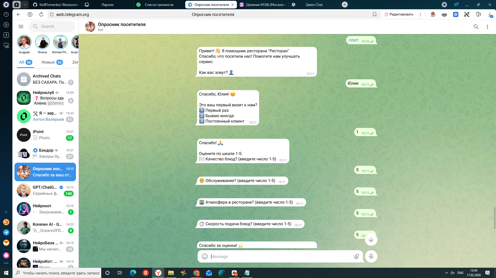
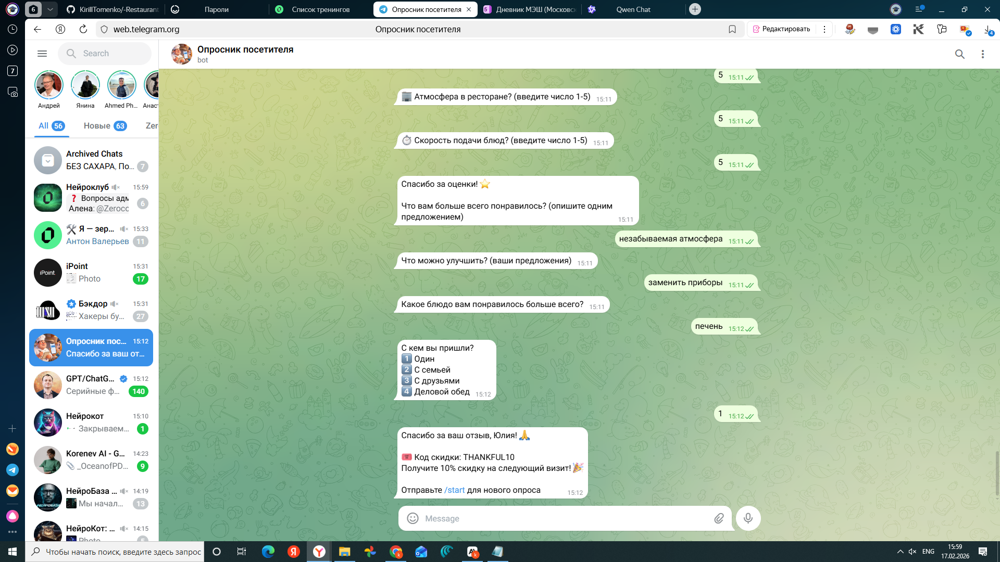
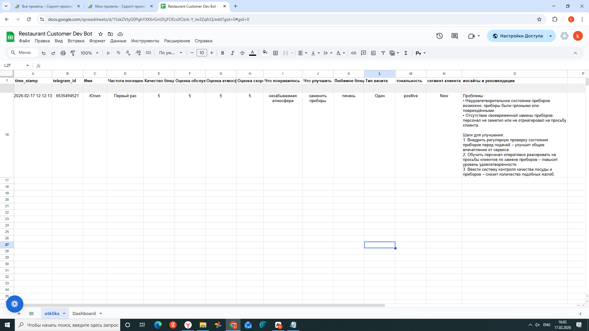

# 🍽️ Restaurant Feedback Bot


> Telegram-бот для автоматизированного сбора обратной связи от посетителей ресторана с интеграцией в Google Sheets и AI-анализом отзывов

**Telegram:** [@oprosnik_rest_bot](https://t.me/oprosnik_rest_bot)

---

## 📋 О проекте

**Restaurant Feedback Bot** — автоматизированное решение для сбора и анализа отзывов гостей ресторана в реальном времени. Бот ведёт пошаговый диалог с посетителем, собирает структурированную обратную связь, сохраняет данные в Google Таблицы и автоматически генерирует AI-аналитику по каждому отзыву.

---

## ✨ Функционал

### 💬 Опросник (10 шагов)
- Персонализированное приветствие по имени
- Определение типа посетителя (первый раз / бывало иногда / постоянный клиент)
- Оценка по 4 метрикам (шкала 1–5): качество блюд, обслуживание, атмосфера, скорость подачи
- Открытые вопросы: что понравилось, что улучшить, любимое блюдо
- Определение типа визита: один, с семьёй, с друзьями, деловой обед
- Промокод на скидку по завершении опроса

### 📊 Google Sheets интеграция
Каждый ответ автоматически сохраняется в таблицу:

| Столбец | Описание |
|---------|----------|
| `time_stamp` | Дата и время отзыва |
| `telegram_id` | ID пользователя Telegram |
| `Имя` | Имя посетителя |
| `Частота посещений` | Тип гостя |
| `Качество блюд` | Оценка 1–5 |
| `Оценка обслуживания` | Оценка 1–5 |
| `Оценка атмосферы` | Оценка 1–5 |
| `Оценка скорости` | Оценка 1–5 |
| `Что понравилось` | Текст |
| `Что улучшить` | Текст |
| `Любимое блюдо` | Текст |
| `Тип визита` | Категория |
| `тональность` | 🤖 AI-анализ |
| `сегмент клиента` | 🤖 AI-анализ |
| `инсайты и рекомендации` | 🤖 AI-анализ |

### 🤖 AI-анализ отзывов (последние 3 столбца)

После каждого опроса **OpenAI GPT автоматически** анализирует отзыв и добавляет в таблицу:

- **тональность** — `positive` / `neutral` / `negative`
- **сегмент клиента** — `New` / `Regular` / `AtRisk`
- **инсайты и рекомендации** — конкретные советы по улучшению сервиса

> ⚠️ **Важно:** AI-анализ работает только при наличии `OPENAI_API_KEY`. Без него бот продолжает работать, но последние 3 столбца останутся пустыми.

---

## 🖼️ Скриншоты

### Диалог с ботом



### Данные в Google Sheets с AI-анализом


---

## 🛠️ Технологии

- **Python 3.11** — основной язык
- **Flask** — webhook-сервер
- **Telegram Bot API** — взаимодействие с пользователями
- **Google Apps Script** — запись данных в Google Sheets
- **OpenAI API (GPT)** — AI-анализ отзывов
- **Replit Autoscale** — хостинг 24/7

---

## 🚀 Установка и запуск

### Шаг 1: Клонируйте репозиторий

```bash
git clone https://github.com/KirillTomenko/-Restaurant-Feedback-Bot.git
cd -Restaurant-Feedback-Bot
pip install -r requirements.txt
```

### Шаг 2: Создайте Telegram бота

1. Напишите [@BotFather](https://t.me/botfather) в Telegram
2. Отправьте `/newbot` и следуйте инструкциям
3. Сохраните полученный **токен**

### Шаг 3: Настройте Google Sheets

#### 3.1 Создайте таблицу
Создайте новую Google Таблицу и добавьте заголовки в первую строку:
```
time_stamp | telegram_id | Имя | Частота посещений | Качество блюд |
Оценка обслуживания | Оценка атмосферы | Оценка скорости |
Что понравилось | Что улучшить | Любимое блюдо | Тип визита |
тональность | сегмент клиента | инсайты и рекомендации
```

#### 3.2 Создайте Google Apps Script

1. В таблице нажмите **Расширения → Apps Script**
2. Удалите весь код и вставьте:

```javascript
function doPost(e) {
  try {
    var data = JSON.parse(e.postData.contents);
    var sheet = SpreadsheetApp.getActiveSpreadsheet().getActiveSheet();

    sheet.appendRow([
      data.timestamp,
      data.chat_id,
      data.client_name,
      data.visit_frequency,
      data.rating_food,
      data.rating_service,
      data.rating_atmosphere,
      data.rating_speed,
      data.feedback_positive,
      data.feedback_negative,
      data.favorite_dish,
      data.visit_type,
      data.sentiment,        // тональность (AI)
      data.client_segment,   // сегмент клиента (AI)
      data.recommendations   // инсайты и рекомендации (AI)
    ]);

    return ContentService
      .createTextOutput(JSON.stringify({'result': 'success'}))
      .setMimeType(ContentService.MimeType.JSON);
  } catch(error) {
    return ContentService
      .createTextOutput(JSON.stringify({'result': 'error', 'message': error.toString()}))
      .setMimeType(ContentService.MimeType.JSON);
  }
}

function doGet(e) {
  return ContentService
    .createTextOutput(JSON.stringify({'status': 'ok'}))
    .setMimeType(ContentService.MimeType.JSON);
}
```

3. Нажмите **Развернуть → Новое развертывание**
4. Тип: **Веб-приложение**
5. Выполнять как: **Я**
6. Доступ: **Все**
7. Нажмите **Развернуть** и скопируйте **URL скрипта**

### Шаг 4: Получите OpenAI API Key (для AI-анализа)

1. Зарегистрируйтесь на [platform.openai.com](https://platform.openai.com)
2. Перейдите в **API Keys → Create new secret key**
3. Сохраните ключ

> Без этого ключа бот работает, но **последние 3 столбца** (тональность, сегмент, инсайты) будут пустыми.

### Шаг 5: Настройте переменные окружения

Создайте файл `.env`:
```env
TELEGRAM_BOT_TOKEN=ваш_токен_от_botfather
OPENAI_API_KEY=ваш_ключ_openai
GAS_URL=url_вашего_apps_script
```

### Шаг 6: Запустите бота

```bash
python main.py
```

Установите webhook:
```
https://api.telegram.org/botВАШ_ТОКЕН/setWebhook?url=https://ваш-сервер.com/webhook
```

---

## ☁️ Деплой на Replit (рекомендуется)

1. Форкните репозиторий или создайте новый Repl
2. Загрузите файлы проекта
3. Откройте **Secrets** и добавьте три ключа:
   - `TELEGRAM_BOT_TOKEN`
   - `OPENAI_API_KEY`
   - `GAS_URL`
4. Нажмите **Deploy → Autoscale**
5. Скопируйте URL деплоя и установите webhook:
```
https://api.telegram.org/botВАШ_ТОКЕН/setWebhook?url=https://ваш-repl.replit.app/webhook
```

---

## 📁 Структура проекта

```
├── main.py              # Flask-сервер + логика бота + AI-анализ
├── conversation.py      # Вспомогательные функции диалога
├── sheets_handler.py    # Модуль работы с Google Sheets
├── requirements.txt     # Зависимости Python
├── .replit              # Конфигурация Replit
└── Procfile             # Команда запуска
```

---

## ❓ Частые вопросы

**Пользователи видят мою Google таблицу?**
Нет. Пользователи взаимодействуют только через Telegram. Данные сохраняются в таблицу незаметно для них. Таблица приватная — видите только вы и те, кому вы дали доступ.

**Бот работает без OpenAI?**
Да. Без `OPENAI_API_KEY` бот полностью работает — собирает отзывы и сохраняет в Sheets. Просто последние 3 столбца (тональность, сегмент клиента, инсайты) будут пустыми.

**Можно адаптировать под другой бизнес?**
Да. Измените вопросы в `main.py` в функции `handle_conversation()` и обновите поля в Google Apps Script.

---

## 🔮 Планы развития

- [ ] Inline-кнопки вместо ввода цифр
- [ ] Уведомления менеджеру при низких оценках
- [ ] Dashboard с визуализацией статистики
- [ ] Мультиязычность (RU / EN)
- [ ] Интеграция с CRM

---

## 📄 Лицензия

MIT License — используйте свободно для своих проектов.

---

<div align="center">

**Сделано с ❤️ для улучшения качества сервиса**

[🤖 Попробовать бота](https://t.me/oprosnik_rest_bot) · [⭐ Поставить звезду](https://github.com/KirillTomenko/-Restaurant-Feedback-Bot)

</div>
